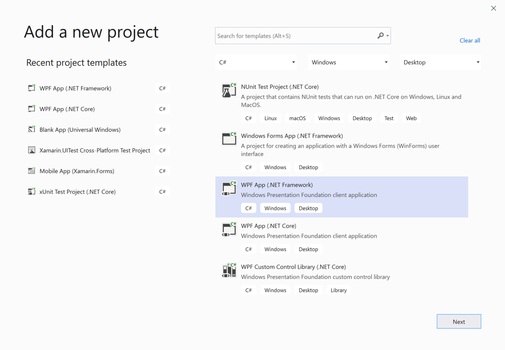
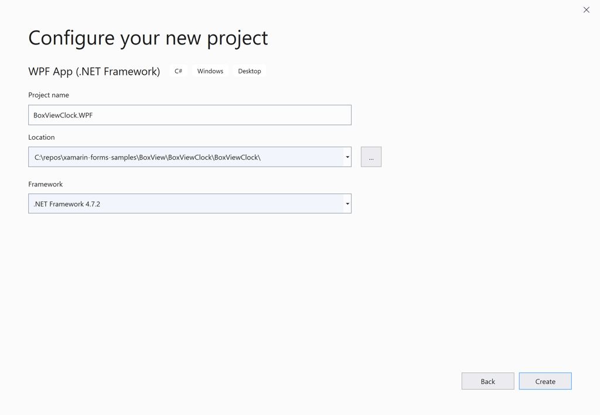
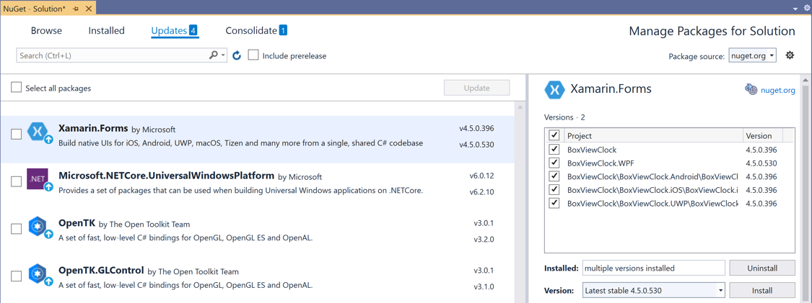

# WPF platform setup


Xamarin.Forms now has preview support for the Windows Presentation Foundation (WPF). This article demonstrates how to add a WPF project to a Xamarin.Forms solution.

> [!IMPORTANT]
> Xamarin.Forms support for WPF is provided by the community. For more information, see [Xamarin.Forms Platform Support](https://github.com/xamarin/Xamarin.Forms/wiki/Platform-Support).

Before you start, create a new Xamarin.Forms solution in Visual Studio 2019, or use an existing Xamarin.Forms solution, for example, [**BoxViewClock**](https://docs.microsoft.com/samples/xamarin/xamarin-forms-samples/boxview-boxviewclock). You can only add WPF apps to a Xamarin.Forms solution in Windows.

## Add a WPF application

Follow these instructions to add a WPF application that will run on the Windows 7, 8, and 10 desktops:

1. In Visual Studio 2019, right-click on the solution name in the **Solution Explorer** and choose **Add > New Project...**.

2. In the **Add a new project** window, select **C#** in the **Languages** drop down, select **Windows** in the **Platforms** drop down, and select **Desktop** in the **Project type** drop down. In the list of project types, choose **WPF App (.NET Framework)**:

    

    Press the **Next** button.

3. In the **Configure your new project** window, type a name for the project with a **WPF** extension, for example, **BoxViewClock.WPF**. Click the **Browse** button, select the **BoxViewClock** folder, and press **Select Folder** to put the WPF project in the same directory as the other projects in the solution:

    

    Press the **Create** button to create the project.

4. In the **Solution Explorer**, right click the new **BoxViewClock.WPF** project and select **Manage NuGet Packages...**. Select the **Browse** tab, and search for **Xamarin.Forms.Platform.WPF**:

    

    Select the package and click the **Install** button.

5. Right click the solution name in the **Solution Explorer** and select **Manage NuGet Packages for Solution...**. Select the **Updates** tab and then select the **Xamarin.Forms** package. Select all the projects and update them to the same Xamarin.Forms version:

    

6. In the WPF project, right-click on **References** and select **Add Reference...**. In the **Reference Manager** dialog, select **Projects** at the left, and check the checkbox adjacent to the **BoxViewClock** project:

    

    Press the **OK** button.

7. Edit the **MainWindow.xaml** file of the WPF project. In the `Window` tag, add an XML namespace declaration for the **Xamarin.Forms.Platform.WPF** assembly and namespace:

    ```xaml
    xmlns:wpf="clr-namespace:Xamarin.Forms.Platform.WPF;assembly=Xamarin.Forms.Platform.WPF"
    ```

    Now change the `Window` tag to `wpf:FormsApplicationPage`. Change the `Title` setting to the name of your application, for example, **BoxViewClock**. The completed XAML file should look like this:

    ```xaml
    <wpf:FormsApplicationPage x:Class="BoxViewClock.WPF.MainWindow"
            xmlns="http://schemas.microsoft.com/winfx/2006/xaml/presentation"
            xmlns:x="http://schemas.microsoft.com/winfx/2006/xaml"
            xmlns:d="http://schemas.microsoft.com/expression/blend/2008"
            xmlns:mc="http://schemas.openxmlformats.org/markup-compatibility/2006"
            xmlns:local="clr-namespace:BoxViewClock.WPF"
            xmlns:wpf="clr-namespace:Xamarin.Forms.Platform.WPF;assembly=Xamarin.Forms.Platform.WPF"            
            mc:Ignorable="d"
            Title="BoxViewClock" Height="450" Width="800">
        <Grid>

        </Grid>
    </wpf:FormsApplicationPage>
    ```

8. Edit the **MainWindow.xaml.cs** file of the WPF project. Add two new `using` directives:

    ```csharp
    using Xamarin.Forms;
    using Xamarin.Forms.Platform.WPF;
    ```

    Change the base class of `MainWindow` from `Window` to `FormsApplicationPage`. Following the `InitializeComponent` call, add the following two statements:

    ```csharp
    Forms.Init();
    LoadApplication(new BoxViewClock.App());
    ```

    Except for comments and unused `using` directives, the complete **MainWindows.xaml.cs** file should look like this:

    ```csharp
    using Xamarin.Forms;
    using Xamarin.Forms.Platform.WPF;

    namespace BoxViewClock.WPF
    {
        public partial class MainWindow : FormsApplicationPage
        {
            public MainWindow()
            {
                InitializeComponent();

                Forms.Init();
                LoadApplication(new BoxViewClock.App());
            }
        }
    }
    ```

9. Right-click the WPF project in the **Solution Explorer** and select **Set as Startup Project**. Press F5 to run the program with the Visual Studio debugger on the Windows desktop:

    

## Platform specifics

You can determine what platform your Xamarin.Forms application is running on from either code or XAML. This allows you to change program characteristics when it's running on WPF. In code, compare the value of `Device.RuntimePlatform` with the `Device.WPF` constant (which equals the string "WPF"). If there's a match, the application is running on WPF.

In XAML, you can use the `OnPlatform` tag to select a property value specific to the platform:

```xaml
<Button.TextColor>
    <OnPlatform x:TypeArguments="Color">
        <On Platform="iOS" Value="White" />
        <On Platform="macOS" Value="White" />
        <On Platform="Android" Value="Black" />
        <On Platform="WPF" Value="Blue" />
    </OnPlatform>
</Button.TextColor>
```

## Window size

You can adjust the initial size of the window in the WPF **MainWindow.xaml** file:

```xaml
Title="BoxViewClock" Height="450" Width="800"
```

## Issues

This is a preview, so you should expect that not everything is production ready. Not all NuGet packages for Xamarin.Forms are ready for WPF, and some features might not be fully working.

## Related video

> [!VIDEO https://youtube.com/embed/Fy9N6OSxK64]

**Xamarin.Forms 3.0 WPF support video**
