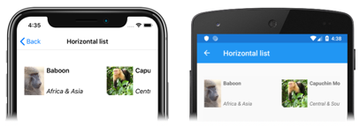
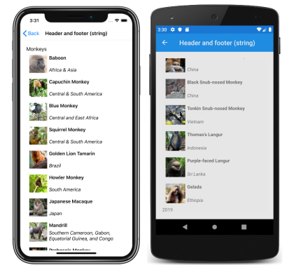
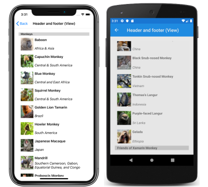
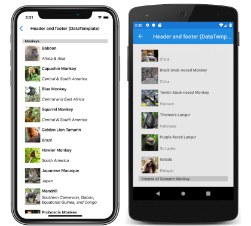
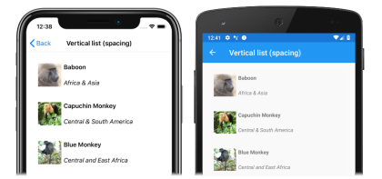
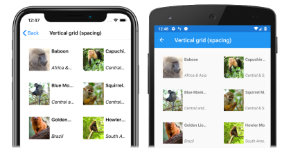
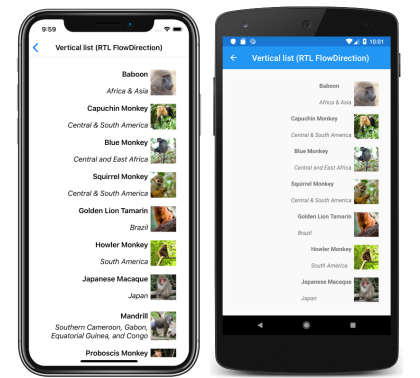

# Xamarin.Forms CollectionView Layout

[ Download the sample](https://docs.microsoft.com/samples/xamarin/xamarin-forms-samples/userinterface-collectionviewdemos/)

[`CollectionView`](xref:Xamarin.Forms.CollectionView) defines the following properties that control layout:

- [`ItemsLayout`](xref:Xamarin.Forms.ItemsLayout), of type [`IItemsLayout`](xref:Xamarin.Forms.IItemsLayout), specifies the layout to be used.
- [`ItemSizingStrategy`](xref:Xamarin.Forms.ItemsView.ItemSizingStrategy), of type [`ItemSizingStrategy`](xref:Xamarin.Forms.ItemSizingStrategy), specifies the item measure strategy to be used.

These properties are backed by [`BindableProperty`](xref:Xamarin.Forms.BindableProperty) objects, which means that the properties can be targets of data bindings.

By default, a [`CollectionView`](xref:Xamarin.Forms.CollectionView) will display its items in a vertical list. However, any of the following layouts can be used:

- Vertical list – a single column list that grows vertically as new items are added.
- Horizontal list – a single row list that grows horizontally as new items are added.
- Vertical grid – a multi-column grid that grows vertically as new items are added.
- Horizontal grid – a multi-row grid that grows horizontally as new items are added.

These layouts can be specified by setting the [`ItemsLayout`](xref:Xamarin.Forms.ItemsView.ItemsLayout) property to class that derives from the [`ItemsLayout`](xref:Xamarin.Forms.ItemsLayout) class. This class defines the following properties:

- [`Orientation`](xref:Xamarin.Forms.ItemsLayout.Orientation), of type [`ItemsLayoutOrientation`](xref:Xamarin.Forms.ItemsLayoutOrientation), specifies the direction in which the [`CollectionView`](xref:Xamarin.Forms.CollectionView) expands as items are added.
- [`SnapPointsAlignment`](xref:Xamarin.Forms.ItemsLayout.SnapPointsAlignment), of type [`SnapPointsAlignment`](xref:Xamarin.Forms.SnapPointsAlignment), specifies how snap points are aligned with items.
- [`SnapPointsType`](xref:Xamarin.Forms.ItemsLayout.SnapPointsType), of type [`SnapPointsType`](xref:Xamarin.Forms.SnapPointsType), specifies the behavior of snap points when scrolling.

These properties are backed by [`BindableProperty`](xref:Xamarin.Forms.BindableProperty) objects, which means that the properties can be targets of data bindings. For more information about snap points, see [Snap points](scrolling.md#snap-points) in the [Xamarin.Forms CollectionView Scrolling](scrolling.md) guide.

The [`ItemsLayoutOrientation`](xref:Xamarin.Forms.ItemsLayoutOrientation) enumeration defines the following members:

- `Vertical` indicates that the [`CollectionView`](xref:Xamarin.Forms.CollectionView) will expand vertically as items are added.
- `Horizontal` indicates that the [`CollectionView`](xref:Xamarin.Forms.CollectionView) will expand horizontally as items are added.

The `LinearItemsLayout` class inherits from the [`ItemsLayout`](xref:Xamarin.Forms.ItemsLayout) class, and defines an `ItemSpacing` property, of type `double`, that represents the empty space around each item. The default value of this property is 0, and its value must always be greater than or equal to 0. The `LinearItemsLayout` class also defines static `Vertical` and `Horizontal` members. These members can be used to create vertical or horizontal lists, respectively. Alternatively, a `LinearItemsLayout` object can be created, specifying an [`ItemsLayoutOrientation`](xref:Xamarin.Forms.ItemsLayoutOrientation) enumeration member as an argument.

The [`GridItemsLayout`](xref:Xamarin.Forms.GridItemsLayout) class inherits from the [`ItemsLayout`](xref:Xamarin.Forms.ItemsLayout) class, and defines the following properties:

- `VerticalItemSpacing`, of type `double`, that represents the vertical empty space around each item. The default value of this property is 0, and its value must always be greater than or equal to 0.
- `HorizontalItemSpacing`, of type `double`, that represents the horizontal empty space around each item. The default value of this property is 0, and its value must always be greater than or equal to 0.
- `Span`, of type `int`, that represents the number of columns or rows to display in the grid. The default value of this property is 1, and its value must always be greater than or equal to 1.

These properties are backed by [`BindableProperty`](xref:Xamarin.Forms.BindableProperty) objects, which means that the properties can be targets of data bindings.

> [!NOTE]
> [`CollectionView`](xref:Xamarin.Forms.CollectionView) uses the native layout engines to perform layout.

## Vertical list

By default, [`CollectionView`](xref:Xamarin.Forms.CollectionView) will display its items in a vertical list layout. Therefore, it's not necessary to set the [`ItemsLayout`](xref:Xamarin.Forms.ItemsView.ItemsLayout) property to use this layout:

```xaml
<CollectionView ItemsSource="{Binding Monkeys}">
    <CollectionView.ItemTemplate>
        <DataTemplate>
            <Grid Padding="10">
                <Grid.RowDefinitions>
                    <RowDefinition Height="Auto" />
                    <RowDefinition Height="Auto" />
                </Grid.RowDefinitions>
                <Grid.ColumnDefinitions>
                    <ColumnDefinition Width="Auto" />
                    <ColumnDefinition Width="Auto" />
                </Grid.ColumnDefinitions>
                <Image Grid.RowSpan="2"
                       Source="{Binding ImageUrl}"
                       Aspect="AspectFill"
                       HeightRequest="60"
                       WidthRequest="60" />
                <Label Grid.Column="1"
                       Text="{Binding Name}"
                       FontAttributes="Bold" />
                <Label Grid.Row="1"
                       Grid.Column="1"
                       Text="{Binding Location}"
                       FontAttributes="Italic"
                       VerticalOptions="End" />
            </Grid>
        </DataTemplate>
    </CollectionView.ItemTemplate>
</CollectionView>
```

However, for completeness, a [`CollectionView`](xref:Xamarin.Forms.CollectionView) can be set to display its items in a vertical list by setting its [`ItemsLayout`](xref:Xamarin.Forms.ItemsView.ItemsLayout) property to `VerticalList`:

```xaml
<CollectionView ItemsSource="{Binding Monkeys}"
                ItemsLayout="VerticalList">
    ...
</CollectionView>
```

Alternatively, this can also be accomplished by setting the [`ItemsLayout`](xref:Xamarin.Forms.ItemsView.ItemsLayout) property to a `LinearItemsLayout` object, specifying the `Vertical` [`ItemsLayoutOrientation`](xref:Xamarin.Forms.ItemsLayoutOrientation) enumeration member as the `Orientation` property value:

```xaml
<CollectionView ItemsSource="{Binding Monkeys}">
    <CollectionView.ItemsLayout>
        <LinearItemsLayout Orientation="Vertical" />
    </CollectionView.ItemsLayout>
    ...
</CollectionView>
```

The equivalent C# code is:

```csharp
CollectionView collectionView = new CollectionView
{
    ...
    ItemsLayout = LinearItemsLayout.Vertical
};
```

This results in a single column list, which grows vertically as new items are added:

[](layout-images/vertical-list-large.png#lightbox "CollectionView vertical list layout")

## Horizontal list

[`CollectionView`](xref:Xamarin.Forms.CollectionView) can display its items in a horizontal list by setting its [`ItemsLayout`](xref:Xamarin.Forms.ItemsView.ItemsLayout) property to `HorizontalList`:

```xaml
<CollectionView ItemsSource="{Binding Monkeys}"
                ItemsLayout="HorizontalList">
    <CollectionView.ItemTemplate>
        <DataTemplate>
            <Grid Padding="10">
                <Grid.RowDefinitions>
                    <RowDefinition Height="35" />
                    <RowDefinition Height="35" />
                </Grid.RowDefinitions>
                <Grid.ColumnDefinitions>
                    <ColumnDefinition Width="70" />
                    <ColumnDefinition Width="140" />
                </Grid.ColumnDefinitions>
                <Image Grid.RowSpan="2"
                       Source="{Binding ImageUrl}"
                       Aspect="AspectFill"
                       HeightRequest="60"
                       WidthRequest="60" />
                <Label Grid.Column="1"
                       Text="{Binding Name}"
                       FontAttributes="Bold"
                       LineBreakMode="TailTruncation" />
                <Label Grid.Row="1"
                       Grid.Column="1"
                       Text="{Binding Location}"
                       LineBreakMode="TailTruncation"
                       FontAttributes="Italic"
                       VerticalOptions="End" />
            </Grid>
        </DataTemplate>
    </CollectionView.ItemTemplate>
</CollectionView>
```

Alternatively, this layout can also be accomplished by setting the [`ItemsLayout`](xref:Xamarin.Forms.ItemsView.ItemsLayout) property to a `LinearItemsLayout` object, specifying the `Horizontal` [`ItemsLayoutOrientation`](xref:Xamarin.Forms.ItemsLayoutOrientation) enumeration member as the `Orientation` property value:

```xaml
<CollectionView ItemsSource="{Binding Monkeys}">
    <CollectionView.ItemsLayout>
        <LinearItemsLayout Orientation="Horizontal" />
    </CollectionView.ItemsLayout>
    ...
</CollectionView>
```

The equivalent C# code is:

```csharp
CollectionView collectionView = new CollectionView
{
    ...
    ItemsLayout = LinearItemsLayout.Horizontal
};
```

This results in a single row list, which grows horizontally as new items are added:

[](layout-images/horizontal-list-large.png#lightbox "CollectionView horizontal list layout")

## Vertical grid

[`CollectionView`](xref:Xamarin.Forms.CollectionView) can display its items in a vertical grid by setting its [`ItemsLayout`](xref:Xamarin.Forms.ItemsView.ItemsLayout) property to a [`GridItemsLayout`](xref:Xamarin.Forms.GridItemsLayout) object whose [`Orientation`](xref:Xamarin.Forms.ItemsLayout.Orientation) property is set to `Vertical`:

```xaml
<CollectionView ItemsSource="{Binding Monkeys}">
    <CollectionView.ItemsLayout>
       <GridItemsLayout Orientation="Vertical"
                        Span="2" />
    </CollectionView.ItemsLayout>
    <CollectionView.ItemTemplate>
        <DataTemplate>
            <Grid Padding="10">
                <Grid.RowDefinitions>
                    <RowDefinition Height="35" />
                    <RowDefinition Height="35" />
                </Grid.RowDefinitions>
                <Grid.ColumnDefinitions>
                    <ColumnDefinition Width="70" />
                    <ColumnDefinition Width="80" />
                </Grid.ColumnDefinitions>
                <Image Grid.RowSpan="2"
                       Source="{Binding ImageUrl}"
                       Aspect="AspectFill"
                       HeightRequest="60"
                       WidthRequest="60" />
                <Label Grid.Column="1"
                       Text="{Binding Name}"
                       FontAttributes="Bold"
                       LineBreakMode="TailTruncation" />
                <Label Grid.Row="1"
                       Grid.Column="1"
                       Text="{Binding Location}"
                       LineBreakMode="TailTruncation"
                       FontAttributes="Italic"
                       VerticalOptions="End" />
            </Grid>
        </DataTemplate>
    </CollectionView.ItemTemplate>
</CollectionView>
```

The equivalent C# code is:

```csharp
CollectionView collectionView = new CollectionView
{
    ...
    ItemsLayout = new GridItemsLayout(2, ItemsLayoutOrientation.Vertical)
};
```

By default, a vertical [`GridItemsLayout`](xref:Xamarin.Forms.GridItemsLayout) will display items in a single column. However, this example sets the `GridItemsLayout.Span` property to 2. This results in a two-column grid, which grows vertically as new items are added:

[](layout-images/vertical-grid-large.png#lightbox "CollectionView vertical grid layout")

## Horizontal grid

[`CollectionView`](xref:Xamarin.Forms.CollectionView) can display its items in a horizontal grid by setting its [`ItemsLayout`](xref:Xamarin.Forms.ItemsView.ItemsLayout) property to a [`GridItemsLayout`](xref:Xamarin.Forms.GridItemsLayout) object whose[`Orientation`](xref:Xamarin.Forms.ItemsLayout.Orientation) property is set to `Horizontal`:

```xaml
<CollectionView ItemsSource="{Binding Monkeys}">
    <CollectionView.ItemsLayout>
       <GridItemsLayout Orientation="Horizontal"
                        Span="4" />
    </CollectionView.ItemsLayout>
    <CollectionView.ItemTemplate>
        <DataTemplate>
            <Grid Padding="10">
                <Grid.RowDefinitions>
                    <RowDefinition Height="35" />
                    <RowDefinition Height="35" />
                </Grid.RowDefinitions>
                <Grid.ColumnDefinitions>
                    <ColumnDefinition Width="70" />
                    <ColumnDefinition Width="140" />
                </Grid.ColumnDefinitions>
                <Image Grid.RowSpan="2"
                       Source="{Binding ImageUrl}"
                       Aspect="AspectFill"
                       HeightRequest="60"
                       WidthRequest="60" />
                <Label Grid.Column="1"
                       Text="{Binding Name}"
                       FontAttributes="Bold"
                       LineBreakMode="TailTruncation" />
                <Label Grid.Row="1"
                       Grid.Column="1"
                       Text="{Binding Location}"
                       LineBreakMode="TailTruncation"
                       FontAttributes="Italic"
                       VerticalOptions="End" />
            </Grid>
        </DataTemplate>
    </CollectionView.ItemTemplate>
</CollectionView>
```

The equivalent C# code is:

```csharp
CollectionView collectionView = new CollectionView
{
    ...
    ItemsLayout = new GridItemsLayout(4, ItemsLayoutOrientation.Horizontal)
};
```

By default, a horizontal [`GridItemsLayout`](xref:Xamarin.Forms.GridItemsLayout) will display items in a single row. However, this example sets the `GridItemsLayout.Span` property to 4. This results in a four-row grid, which grows horizontally as new items are added:

[](layout-images/horizontal-grid-large.png#lightbox "CollectionView horizontal grid layout")

## Headers and footers

[`CollectionView`](xref:Xamarin.Forms.CollectionView) can present a header and footer that scroll with the items in the list. The header and footer can be strings, views, or [`DataTemplate`](xref:Xamarin.Forms.DataTemplate) objects.

[`CollectionView`](xref:Xamarin.Forms.CollectionView) defines the following properties for specifying the header and footer:

- `Header`, of type `object`, specifies the string, binding, or view that will be displayed at the start of the list.
- `HeaderTemplate`, of type [`DataTemplate`](xref:Xamarin.Forms.DataTemplate), specifies the `DataTemplate` to use to format the `Header`.
- `Footer`, of type `object`, specifies the string, binding, or view that will be displayed at the end of the list.
- `FooterTemplate`, of type [`DataTemplate`](xref:Xamarin.Forms.DataTemplate), specifies the `DataTemplate` to use to format the `Footer`.

These properties are backed by [`BindableProperty`](xref:Xamarin.Forms.BindableProperty) objects, which means that the properties can be targets of data bindings.

When a header is added to a layout that grows horizontally, from left to right, the header is displayed to the left of the list. Similarly, when a footer is added to a layout that grows horizontally, from left to right, the footer is displayed to the right of the list.

### Display strings in the header and footer

The `Header` and `Footer` properties can be set to `string` values, as shown in the following example:

```xaml
<CollectionView ItemsSource="{Binding Monkeys}"
                Header="Monkeys"
                Footer="2019">
    ...
</CollectionView>
```

The equivalent C# code is:

```csharp
CollectionView collectionView = new CollectionView
{
    Header = "Monkeys",
    Footer = "2019"
};
collectionView.SetBinding(ItemsView.ItemsSourceProperty, "Monkeys");
```

This code results in the following screenshots, with the header shown in the iOS screenshot, and the footer shown in the Android screenshot:

[](layout-images/header-footer-string-large.png#lightbox "CollectionView string header and footer")

### Display views in the header and footer

The `Header` and `Footer` properties can each be set to a view. This can be a single view, or a view that contains multiple child views. The following example shows the `Header` and `Footer` properties each set to a [`StackLayout`](xref:Xamarin.Forms.StackLayout) object that contains a [`Label`](xref:Xamarin.Forms.Label) object:

```xaml
<CollectionView ItemsSource="{Binding Monkeys}">
    <CollectionView.Header>
        <StackLayout BackgroundColor="LightGray">
            <Label Margin="10,0,0,0"
                   Text="Monkeys"
                   FontSize="Small"
                   FontAttributes="Bold" />
        </StackLayout>
    </CollectionView.Header>
    <CollectionView.Footer>
        <StackLayout BackgroundColor="LightGray">
            <Label Margin="10,0,0,0"
                   Text="Friends of Xamarin Monkey"
                   FontSize="Small"
                   FontAttributes="Bold" />
        </StackLayout>
    </CollectionView.Footer>
    ...
</CollectionView>
```

The equivalent C# code is:

```csharp
CollectionView collectionView = new CollectionView
{
    Header = new StackLayout
    {
        Children =
        {
            new Label { Text = "Monkeys", ... }
        }
    },
    Footer = new StackLayout
    {
        Children =
        {
            new Label { Text = "Friends of Xamarin Monkey", ... }
        }
    }
};
collectionView.SetBinding(ItemsView.ItemsSourceProperty, "Monkeys");
```

This code results in the following screenshots, with the header shown in the iOS screenshot, and the footer shown in the Android screenshot:

[](layout-images/header-footer-view-large.png#lightbox "CollectionView view header and footer")

### Display a templated header and footer

The `HeaderTemplate` and `FooterTemplate` properties can be set to [`DataTemplate`](xref:Xamarin.Forms.DataTemplate) objects that are used to format the header and footer. In this scenario, the `Header` and `Footer` properties must bind to the current source for the templates to be applied, as shown in the following example:

```xaml
<CollectionView ItemsSource="{Binding Monkeys}"
                Header="{Binding .}"
                Footer="{Binding .}">
    <CollectionView.HeaderTemplate>
        <DataTemplate>
            <StackLayout BackgroundColor="LightGray">
                <Label Margin="10,0,0,0"
                       Text="Monkeys"
                       FontSize="Small"
                       FontAttributes="Bold" />
            </StackLayout>
        </DataTemplate>
    </CollectionView.HeaderTemplate>
    <CollectionView.FooterTemplate>
        <DataTemplate>
            <StackLayout BackgroundColor="LightGray">
                <Label Margin="10,0,0,0"
                       Text="Friends of Xamarin Monkey"
                       FontSize="Small"
                       FontAttributes="Bold" />
            </StackLayout>
        </DataTemplate>
    </CollectionView.FooterTemplate>
    ...
</CollectionView>
```

The equivalent C# code is:

```csharp
CollectionView collectionView = new CollectionView
{
    HeaderTemplate = new DataTemplate(() =>
    {
        return new StackLayout { };
    }),
    FooterTemplate = new DataTemplate(() =>
    {
        return new StackLayout { };
    })
};
collectionView.SetBinding(ItemsView.HeaderProperty, ".");
collectionView.SetBinding(ItemsView.FooterProperty, ".");
collectionView.SetBinding(ItemsView.ItemsSourceProperty, "Monkeys");
```

This code results in the following screenshots, with the header shown in the iOS screenshot, and the footer shown in the Android screenshot:

[](layout-images/header-footer-template-large.png#lightbox "CollectionView template header and footer")

## Item spacing

By default, each item in a [`CollectionView`](xref:Xamarin.Forms.CollectionView) doesn't have any empty space around it. This behavior can be changed by setting properties on the items layout used by the `CollectionView`.

When a [`CollectionView`](xref:Xamarin.Forms.CollectionView) sets its [`ItemsLayout`](xref:Xamarin.Forms.ItemsView.ItemsLayout) property to a `LinearItemsLayout` object, the `LinearItemsLayout.ItemSpacing` property can be set to a `double` value that represents the empty space around each item:

```xaml
<CollectionView ItemsSource="{Binding Monkeys}">
    <CollectionView.ItemsLayout>
        <LinearItemsLayout Orientation="Vertical"
                           ItemSpacing="20" />
    </CollectionView.ItemsLayout>
    ...
</CollectionView>
```

> [!NOTE]
> The `LinearItemsLayout.ItemSpacing` property has a validation callback set, which ensures that the value of the property is always greater than or equal to 0.

The equivalent C# code is:

```csharp
CollectionView collectionView = new CollectionView
{
    ...
    ItemsLayout = new LinearItemsLayout(ItemsLayoutOrientation.Vertical)
    {
        ItemSpacing = 20
    }
};
```

This code results in a vertical single column list, that has a spacing of 20 around each item:

[](layout-images/vertical-list-spacing-large.png#lightbox "CollectionView item spacing")

When a [`CollectionView`](xref:Xamarin.Forms.CollectionView) sets its [`ItemsLayout`](xref:Xamarin.Forms.ItemsView.ItemsLayout) property to a [`GridItemsLayout`](xref:Xamarin.Forms.GridItemsLayout) object, the `GridItemsLayout.VerticalItemSpacing` and `GridItemsLayout.HorizontalItemSpacing` properties can be set to `double` values that represent the empty space vertically and horizontally around each item:

```xaml
<CollectionView ItemsSource="{Binding Monkeys}">
    <CollectionView.ItemsLayout>
       <GridItemsLayout Orientation="Vertical"
                        Span="2"
                        VerticalItemSpacing="20"
                        HorizontalItemSpacing="30" />
    </CollectionView.ItemsLayout>
    ...
</CollectionView>
```

> [!NOTE]
> The `GridItemsLayout.VerticalItemSpacing` and `GridItemsLayout.HorizontalItemSpacing` properties have validation callbacks set, which ensure that the values of the properties are always greater than or equal to 0.

The equivalent C# code is:

```csharp
CollectionView collectionView = new CollectionView
{
    ...
    ItemsLayout = new GridItemsLayout(2, ItemsLayoutOrientation.Vertical)
    {
        VerticalItemSpacing = 20,
        HorizontalItemSpacing = 30
    }
};
```

This code results in a vertical two-column grid, that has a vertical spacing of 20 around each item, and a horizontal spacing of 30 around each item:

[](layout-images/vertical-grid-spacing-large.png#lightbox "CollectionView item spacing")

## Item sizing

By default, each item in a [`CollectionView`](xref:Xamarin.Forms.CollectionView) is individually measured and sized, provided that the UI elements in the [`DataTemplate`](xref:Xamarin.Forms.DataTemplate) don't specify fixed sizes. This behavior, which can be changed, is specified by the [`CollectionView.ItemSizingStrategy`](xref:Xamarin.Forms.ItemsView.ItemSizingStrategy) property value. This property value can be set to one of the [`ItemSizingStrategy`](xref:Xamarin.Forms.ItemSizingStrategy) enumeration members:

- `MeasureAllItems` – each item is individually measured. This is the default value.
- `MeasureFirstItem` – only the first item is measured, with all subsequent items being given the same size as the first item.

> [!IMPORTANT]
> The `MeasureFirstItem` sizing strategy will result in increased performance when used in situations where the item size is intended to be uniform across all items.

The following code example shows setting the [`ItemSizingStrategy`](xref:Xamarin.Forms.ItemsView.ItemSizingStrategy) property:

```xaml
<CollectionView ...
                ItemSizingStrategy="MeasureFirstItem">
    ...
</CollectionView>
```

The equivalent C# code is:

```csharp
CollectionView collectionView = new CollectionView
{
    ...
    ItemSizingStrategy = ItemSizingStrategy.MeasureFirstItem
};
```

## Dynamic resizing of items

Items in a [`CollectionView`](xref:Xamarin.Forms.CollectionView) can be dynamically resized at runtime by changing layout related properties of elements within the [`DataTemplate`](xref:Xamarin.Forms.DataTemplate). For example, the following code example changes the [`HeightRequest`](xref:Xamarin.Forms.VisualElement.HeightRequest) and [`WidthRequest`](xref:Xamarin.Forms.VisualElement.WidthRequest) properties of an [`Image`](xref:Xamarin.Forms.Image) object:

```csharp
void OnImageTapped(object sender, EventArgs e)
{
    Image image = sender as Image;
    image.HeightRequest = image.WidthRequest = image.HeightRequest.Equals(60) ? 100 : 60;
}
```

The `OnImageTapped` event handler is executed in response to an [`Image`](xref:Xamarin.Forms.Image) object being tapped, and changes the dimensions of the image so that it's more easily viewed:

[](layout-images/runtime-resizing-large.png#lightbox "CollectionView dynamic item sizing")

## Right-to-left layout

[`CollectionView`](xref:Xamarin.Forms.CollectionView) can layout its content in a right-to-left flow direction by setting its [`FlowDirection`](xref:Xamarin.Forms.VisualElement.FlowDirection) property to [`RightToLeft`](xref:Xamarin.Forms.FlowDirection.RightToLeft). However, the `FlowDirection` property should ideally be set on a page or root layout, which causes all the elements within the page, or root layout, to respond to the flow direction:

```xaml
<ContentPage xmlns="http://xamarin.com/schemas/2014/forms"
             xmlns:x="http://schemas.microsoft.com/winfx/2009/xaml"
             x:Class="CollectionViewDemos.Views.VerticalListFlowDirectionPage"
             Title="Vertical list (RTL FlowDirection)"
             FlowDirection="RightToLeft">
    <StackLayout Margin="20">
        <CollectionView ItemsSource="{Binding Monkeys}">
            ...
        </CollectionView>
    </StackLayout>
</ContentPage>
```

The default [`FlowDirection`](xref:Xamarin.Forms.VisualElement.FlowDirection) for an element with a parent is [`MatchParent`](xref:Xamarin.Forms.FlowDirection.MatchParent). Therefore, the [`CollectionView`](xref:Xamarin.Forms.CollectionView) inherits the `FlowDirection` property value from the [`StackLayout`](xref:Xamarin.Forms.StackLayout), which in turn inherits the `FlowDirection` property value from the [`ContentPage`](xref:Xamarin.Forms.ContentPage). This results in the right-to-left layout shown in the following screenshots:

[](layout-images/vertical-list-rtl-large.png#lightbox "CollectionView right-to-left vertical list layout")

For more information about flow direction, see [Right-to-left localization](~/xamarin-forms/app-fundamentals/localization/right-to-left.md).

## Related links

- [CollectionView (sample)](https://docs.microsoft.com/samples/xamarin/xamarin-forms-samples/userinterface-collectionviewdemos/)
- [Right-to-left localization](~/xamarin-forms/app-fundamentals/localization/right-to-left.md)
- [Xamarin.Forms CollectionView Scrolling](scrolling.md)
