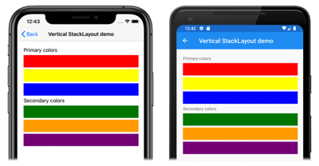
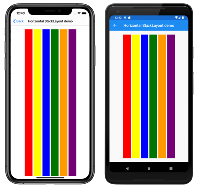
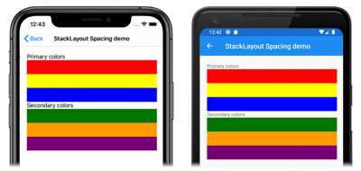
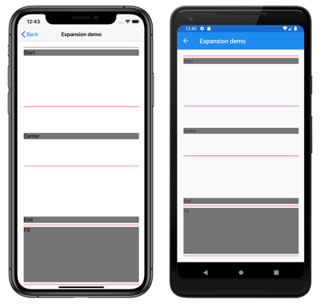
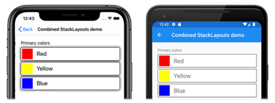

# Xamarin.Forms StackLayout

[ Download the sample](https://docs.microsoft.com/samples/xamarin/xamarin-forms-samples/userinterface-stacklayoutdemos)

[](stacklayout-images/layouts-large.png#lightbox "Xamarin.Forms StackLayout")

A [`StackLayout`](xref:Xamarin.Forms.StackLayout) organizes child views in a one-dimensional stack, either horizontally or vertically. By default, a `StackLayout` is oriented vertically. In addition, a `StackLayout` can be used as a parent layout that contains other child layouts.

The [`StackLayout`](xref:Xamarin.Forms.StackLayout) class defines the following properties:

- [`Orientation`](xref:Xamarin.Forms.StackLayout.Orientation), of type [`StackOrientation`](xref:Xamarin.Forms.StackOrientation), represents the direction in which child views are positioned. The default value of this property is `Vertical`.
- [`Spacing`](xref:Xamarin.Forms.StackLayout.Spacing), of type `double`, indicates the amount of space between each child view. The default value of this property is six device-independent units.

These properties are backed by [`BindableProperty`](xref:Xamarin.Forms.BindableProperty) objects, which means that the properties can be targets of data bindings and styled.

The [`StackLayout`](xref:Xamarin.Forms.StackLayout) class derives from the `Layout<T>` class, which defines a `Children` property of type `IList<T>`. The `Children` property is the `ContentProperty` of the `Layout<T>` class, and therefore does not need to be explicitly set from XAML.

> [!TIP]
> To obtain the best possible layout performance, follow the guidelines at [Optimize layout performance](~/xamarin-forms/deploy-test/performance.md#optimize-layout-performance).

## Vertical orientation

The following XAML shows how to create a vertically oriented [`StackLayout`](xref:Xamarin.Forms.StackLayout) that contains different child views:

```xaml
<ContentPage xmlns="http://xamarin.com/schemas/2014/forms"
             xmlns:x="http://schemas.microsoft.com/winfx/2009/xaml"
             x:Class="StackLayoutDemos.Views.VerticalStackLayoutPage"
             Title="Vertical StackLayout demo">
    <StackLayout Margin="20">
        <Label Text="Primary colors" />
        <BoxView Color="Red" />
        <BoxView Color="Yellow" />
        <BoxView Color="Blue" />
        <Label Text="Secondary colors" />
        <BoxView Color="Green" />
        <BoxView Color="Orange" />
        <BoxView Color="Purple" />
    </StackLayout>
</ContentPage>
```

This example creates a vertical [`StackLayout`](xref:Xamarin.Forms.StackLayout) containing [`Label`](xref:Xamarin.Forms.Label) and [`BoxView`](xref:Xamarin.Forms.BoxView) objects. By default, there are six device-independent units of space between the child views:

[](stacklayout-images/vertical-large.png#lightbox "Vertically oriented StackLayout")

The equivalent C# code is:

```csharp
public class VerticalStackLayoutPageCS : ContentPage
{
    public VerticalStackLayoutPageCS()
    {
        Title = "Vertical StackLayout demo";
        Content = new StackLayout
        {
            Margin = new Thickness(20),
            Children =
            {
                new Label { Text = "Primary colors" },
                new BoxView { Color = Color.Red },
                new BoxView { Color = Color.Yellow },
                new BoxView { Color = Color.Blue },
                new Label { Text = "Secondary colors" },
                new BoxView { Color = Color.Green },
                new BoxView { Color = Color.Orange },
                new BoxView { Color = Color.Purple }
            }
        };
    }
}
```

> [!NOTE]
> The value of the [`Margin`](xref:Xamarin.Forms.View.Margin) property represents the distance between an element and its adjacent elements. For more information, see [Margin and Padding](margin-and-padding.md).

## Horizontal orientation

The following XAML shows how to create a horizontally oriented [`StackLayout`](xref:Xamarin.Forms.StackLayout) by setting its [`Orientation`](xref:Xamarin.Forms.StackLayout.Orientation) property to `Horizontal`:

```xaml
<ContentPage xmlns="http://xamarin.com/schemas/2014/forms"
             xmlns:x="http://schemas.microsoft.com/winfx/2009/xaml"
             x:Class="StackLayoutDemos.Views.HorizontalStackLayoutPage"
             Title="Horizontal StackLayout demo">
    <StackLayout Margin="20"
                 Orientation="Horizontal"
                 HorizontalOptions="Center">
        <BoxView Color="Red" />
        <BoxView Color="Yellow" />
        <BoxView Color="Blue" />
        <BoxView Color="Green" />
        <BoxView Color="Orange" />
        <BoxView Color="Purple" />
    </StackLayout>
</ContentPage>
```

This example creates a horizontal [`StackLayout`](xref:Xamarin.Forms.StackLayout) containing [`BoxView`](xref:Xamarin.Forms.BoxView) objects, with six device-independent units of space between the child views:

[](stacklayout-images/horizontal-large.png#lightbox "Horizontally oriented StackLayout")

The equivalent C# code is:

```csharp
public HorizontalStackLayoutPageCS()
{
    Title = "Horizontal StackLayout demo";
    Content = new StackLayout
    {
        Margin = new Thickness(20),
        Orientation = StackOrientation.Horizontal,
        HorizontalOptions = LayoutOptions.Center,
        Children =
        {
            new BoxView { Color = Color.Red },
            new BoxView { Color = Color.Yellow },
            new BoxView { Color = Color.Blue },
            new BoxView { Color = Color.Green },
            new BoxView { Color = Color.Orange },
            new BoxView { Color = Color.Purple }
        }
    };
}
```

## Space between child views

The spacing between child views in a [`StackLayout`](xref:Xamarin.Forms.StackLayout) can be changed by setting the [`Spacing`](xref:Xamarin.Forms.StackLayout.Spacing) property to a `double` value:

```xaml
<ContentPage xmlns="http://xamarin.com/schemas/2014/forms"
             xmlns:x="http://schemas.microsoft.com/winfx/2009/xaml"
             x:Class="StackLayoutDemos.Views.StackLayoutSpacingPage"
             Title="StackLayout Spacing demo">
    <StackLayout Margin="20"
                 Spacing="0">
        <Label Text="Primary colors" />
        <BoxView Color="Red" />
        <BoxView Color="Yellow" />
        <BoxView Color="Blue" />
        <Label Text="Secondary colors" />
        <BoxView Color="Green" />
        <BoxView Color="Orange" />
        <BoxView Color="Purple" />
    </StackLayout>
</ContentPage>
```

This example creates a vertical [`StackLayout`](xref:Xamarin.Forms.StackLayout) containing [`Label`](xref:Xamarin.Forms.Label) and [`BoxView`](xref:Xamarin.Forms.BoxView) objects that have no spacing between them:

[](stacklayout-images/spacing-large.png#lightbox "StackLayout without any spacing")

> [!TIP]
> The [`Spacing`](xref:Xamarin.Forms.StackLayout.Spacing) property can be set to negative values to make child views overlap.

The equivalent C# code is:

```csharp
public class StackLayoutSpacingPageCS : ContentPage
{
    public StackLayoutSpacingPageCS()
    {
        Title = "StackLayout Spacing demo";
        Content = new StackLayout
        {
            Margin = new Thickness(20),
            Spacing = 0,
            Children =
            {
                new Label { Text = "Primary colors" },
                new BoxView { Color = Color.Red },
                new BoxView { Color = Color.Yellow },
                new BoxView { Color = Color.Blue },
                new Label { Text = "Secondary colors" },
                new BoxView { Color = Color.Green },
                new BoxView { Color = Color.Orange },
                new BoxView { Color = Color.Purple }
            }
        };
    }
}
```

## Position and size of child views

The size and position of child views within a [`StackLayout`](xref:Xamarin.Forms.StackLayout) depends upon the values of the child views' [`HeightRequest`](xref:Xamarin.Forms.VisualElement.HeightRequest) and [`WidthRequest`](xref:Xamarin.Forms.VisualElement.WidthRequest) properties, and the values of their [`HorizontalOptions`](xref:Xamarin.Forms.View.HorizontalOptions) and [`VerticalOptions`](xref:Xamarin.Forms.View.VerticalOptions) properties. In a vertical [`StackLayout`](xref:Xamarin.Forms.StackLayout), child views expand to fill the available width when their size isn't explicitly set. Similarly, in a horizontal `StackLayout`, child views expand to fill the available height when their size isn't explicitly set.

The [`HorizontalOptions`](xref:Xamarin.Forms.View.HorizontalOptions) and [`VerticalOptions`](xref:Xamarin.Forms.View.VerticalOptions) properties of a [`StackLayout`](xref:Xamarin.Forms.StackLayout), and its child views, can be set to fields from the [`LayoutOptions`](xref:Xamarin.Forms.LayoutOptions) struct, which encapsulates two layout preferences:

- *Alignment* determines the position and size of a child view within its parent layout.
- *Expansion* indicates if the child view should use extra space, if it's available.

> [!TIP]
> Don't set the [`HorizontalOptions`](xref:Xamarin.Forms.View.HorizontalOptions) and [`VerticalOptions`](xref:Xamarin.Forms.View.VerticalOptions) properties of a [`StackLayout`](xref:Xamarin.Forms.StackLayout) unless you need to. The default values of `LayoutOptions.Fill` and `LayoutOptions.FillAndExpand` allow for the best layout optimization. Changing these properties has a cost and consumes memory, even when setting them back to the default values.

### Alignment

The following XAML example sets alignment preferences on each child view in the [`StackLayout`](xref:Xamarin.Forms.StackLayout):

```xaml
<ContentPage xmlns="http://xamarin.com/schemas/2014/forms"
             xmlns:x="http://schemas.microsoft.com/winfx/2009/xaml"
             x:Class="StackLayoutDemos.Views.AlignmentPage"
             Title="Alignment demo">
    <StackLayout Margin="20">
        <Label Text="Start"
               BackgroundColor="Gray"
               HorizontalOptions="Start" />
        <Label Text="Center"
               BackgroundColor="Gray"
               HorizontalOptions="Center" />
        <Label Text="End"
               BackgroundColor="Gray"
               HorizontalOptions="End" />
        <Label Text="Fill"
               BackgroundColor="Gray"
               HorizontalOptions="Fill" />
    </StackLayout>
</ContentPage>
```

In this example, alignment preferences are set on the [`Label`](xref:Xamarin.Forms.Label) objects to control their position within the [`StackLayout`](xref:Xamarin.Forms.StackLayout). The [`Start`](xref:Xamarin.Forms.LayoutOptions.Start), [`Center`](xref:Xamarin.Forms.LayoutOptions.Center), [`End`](xref:Xamarin.Forms.LayoutOptions.End), and [`Fill`](xref:Xamarin.Forms.LayoutOptions.Fill) fields are used to define the alignment of the [`Label`](xref:Xamarin.Forms.Label) objects within the parent `StackLayout`:

[](stacklayout-images/alignment-large.png#lightbox "StackLayout with alignment options")

A [`StackLayout`](xref:Xamarin.Forms.StackLayout) only respects the alignment preferences on child views that are in the opposite direction to the `StackLayout` orientation. Therefore, the [`Label`](xref:Xamarin.Forms.Label) child views within the vertically oriented `StackLayout` set their [`HorizontalOptions`](xref:Xamarin.Forms.View.HorizontalOptions) properties to one of the alignment fields:

- [`Start`](xref:Xamarin.Forms.LayoutOptions.Start), which positions the [`Label`](xref:Xamarin.Forms.Label) on the left-hand side of the [`StackLayout`](xref:Xamarin.Forms.StackLayout).
- [`Center`](xref:Xamarin.Forms.LayoutOptions.Center), which centers the [`Label`](xref:Xamarin.Forms.Label) in the [`StackLayout`](xref:Xamarin.Forms.StackLayout).
- [`End`](xref:Xamarin.Forms.LayoutOptions.End), which positions the [`Label`](xref:Xamarin.Forms.Label) on the right-hand side of the [`StackLayout`](xref:Xamarin.Forms.StackLayout).
- [`Fill`](xref:Xamarin.Forms.LayoutOptions.Fill), which ensures that the [`Label`](xref:Xamarin.Forms.Label) fills the width of the [`StackLayout`](xref:Xamarin.Forms.StackLayout).

The equivalent C# code is:

```csharp
public class AlignmentPageCS : ContentPage
{
    public AlignmentPageCS()
    {
        Title = "Alignment demo";
        Content = new StackLayout
        {
            Margin = new Thickness(20),
            Children =
            {
                new Label { Text = "Start", BackgroundColor = Color.Gray, HorizontalOptions = LayoutOptions.Start },
                new Label { Text = "Center", BackgroundColor = Color.Gray, HorizontalOptions = LayoutOptions.Center },
                new Label { Text = "End", BackgroundColor = Color.Gray, HorizontalOptions = LayoutOptions.End },
                new Label { Text = "Fill", BackgroundColor = Color.Gray, HorizontalOptions = LayoutOptions.Fill }
            }
        };
    }
}
```

### Expansion

The following XAML example sets expansion preferences on each [`Label`](xref:Xamarin.Forms.Label) in the [`StackLayout`](xref:Xamarin.Forms.StackLayout):

```xaml
<ContentPage xmlns="http://xamarin.com/schemas/2014/forms"
             xmlns:x="http://schemas.microsoft.com/winfx/2009/xaml"
             x:Class="StackLayoutDemos.Views.ExpansionPage"
             Title="Expansion demo">
    <StackLayout Margin="20">
        <BoxView BackgroundColor="Red"
                 HeightRequest="1" />
        <Label Text="Start"
               BackgroundColor="Gray"
               VerticalOptions="StartAndExpand" />
        <BoxView BackgroundColor="Red"
                 HeightRequest="1" />
        <Label Text="Center"
               BackgroundColor="Gray"
               VerticalOptions="CenterAndExpand" />
        <BoxView BackgroundColor="Red"
                 HeightRequest="1" />
        <Label Text="End"
               BackgroundColor="Gray"
               VerticalOptions="EndAndExpand" />
        <BoxView BackgroundColor="Red"
                 HeightRequest="1" />
        <Label Text="Fill"
               BackgroundColor="Gray"
               VerticalOptions="FillAndExpand" />
        <BoxView BackgroundColor="Red"
                 HeightRequest="1" />
    </StackLayout>
</ContentPage>
```

In this example, expansion preferences are set on the [`Label`](xref:Xamarin.Forms.Label) objects to control their size within the [`StackLayout`](xref:Xamarin.Forms.StackLayout). The [`StartAndExpand`](xref:Xamarin.Forms.LayoutOptions.StartAndExpand), [`CenterAndExpand`](xref:Xamarin.Forms.LayoutOptions.CenterAndExpand), [`EndAndExpand`](xref:Xamarin.Forms.LayoutOptions.EndAndExpand), and [`FillAndExpand`](xref:Xamarin.Forms.LayoutOptions.FillAndExpand) fields are used to define the alignment preference, and whether the `Label` will occupy more space if available within the parent `StackLayout`:

[](stacklayout-images/expansion-large.png#lightbox "StackLayout with expansion options")

A [`StackLayout`](xref:Xamarin.Forms.StackLayout) can only expand child views in the direction of its orientation. Therefore, the vertically oriented `StackLayout` can expand [`Label`](xref:Xamarin.Forms.Label) child views that set their [`VerticalOptions`](xref:Xamarin.Forms.View.VerticalOptions) properties to one of the expansion fields. This means that, for vertical alignment, each `Label` occupies the same amount of space within the `StackLayout`. However, only the final `Label`, which sets its [`VerticalOptions`](xref:Xamarin.Forms.View.VerticalOptions) property to [`FillAndExpand`](xref:Xamarin.Forms.LayoutOptions.FillAndExpand) has a different size.

> [!TIP]
> When using a [`StackLayout`](xref:Xamarin.Forms.StackLayout), ensure that only one child view is set to [`LayoutOptions.Expands`](xref:Xamarin.Forms.LayoutOptions.Expands). This property ensures that the specified child will occupy the largest space that the `StackLayout` can give to it, and it is wasteful to perform these calculations more than once.

The equivalent C# code is:

```csharp
public ExpansionPageCS()
{
    Title = "Expansion demo";
    Content = new StackLayout
    {
        Margin = new Thickness(20),
        Children =
        {
            new BoxView { BackgroundColor = Color.Red, HeightRequest = 1 },
            new Label { Text = "StartAndExpand", BackgroundColor = Color.Gray, VerticalOptions = LayoutOptions.StartAndExpand },
            new BoxView { BackgroundColor = Color.Red, HeightRequest = 1 },
            new Label { Text = "CenterAndExpand", BackgroundColor = Color.Gray, VerticalOptions = LayoutOptions.CenterAndExpand },
            new BoxView { BackgroundColor = Color.Red, HeightRequest = 1 },
            new Label { Text = "EndAndExpand", BackgroundColor = Color.Gray, VerticalOptions = LayoutOptions.EndAndExpand },
            new BoxView { BackgroundColor = Color.Red, HeightRequest = 1 },
            new Label { Text = "FillAndExpand", BackgroundColor = Color.Gray, VerticalOptions = LayoutOptions.FillAndExpand },
            new BoxView { BackgroundColor = Color.Red, HeightRequest = 1 }
        }
    };
}
```

> [!IMPORTANT]
> When all the space in a [`StackLayout`](xref:Xamarin.Forms.StackLayout) is used, expansion preferences have no effect.

For more information about alignment and expansion, see [Layout Options in Xamarin.Forms](layout-options.md).

## Nested StackLayout objects

A [`StackLayout`](xref:Xamarin.Forms.StackLayout) can be used as a parent layout that contains nested child `StackLayout` objects, or other child layouts.

The following XAML shows an example of nesting [`StackLayout`](xref:Xamarin.Forms.StackLayout) objects:

```xaml
<ContentPage xmlns="http://xamarin.com/schemas/2014/forms"
             xmlns:x="http://schemas.microsoft.com/winfx/2009/xaml"
             x:Class="StackLayoutDemos.Views.CombinedStackLayoutPage"
             Title="Combined StackLayouts demo">
    <StackLayout Margin="20">
        ...
        <Frame BorderColor="Black"
               Padding="5">
            <StackLayout Orientation="Horizontal"
                         Spacing="15">
                <BoxView Color="Red" />
                <Label Text="Red"
                       FontSize="Large"
                       VerticalOptions="Center" />
            </StackLayout>
        </Frame>
        <Frame BorderColor="Black"
               Padding="5">
            <StackLayout Orientation="Horizontal"
                         Spacing="15">
                <BoxView Color="Yellow" />
                <Label Text="Yellow"
                       FontSize="Large"
                       VerticalOptions="Center" />
            </StackLayout>
        </Frame>
        <Frame BorderColor="Black"
               Padding="5">
            <StackLayout Orientation="Horizontal"
                         Spacing="15">
                <BoxView Color="Blue" />
                <Label Text="Blue"
                       FontSize="Large"
                       VerticalOptions="Center" />
            </StackLayout>
        </Frame>
        ...
    </StackLayout>
</ContentPage>
```

In this example, the parent [`StackLayout`](xref:Xamarin.Forms.StackLayout) contains nested `StackLayout` objects inside [`Frame`](xref:Xamarin.Forms.Frame) objects. The parent `StackLayout` is oriented vertically, while the child `StackLayout` objects are oriented horizontally:

[](stacklayout-images/combined-large.png#lightbox "Nested StackLayouts")

> [!IMPORTANT]
> The deeper you nest [`StackLayout`](xref:Xamarin.Forms.StackLayout) objects and other layouts, the more the nested layouts will impact performance. For more information, see [Choose the correct layout](~/xamarin-forms/deploy-test/performance.md#choose-the-correct-layout).

The equivalent C# code is:

```csharp
public class CombinedStackLayoutPageCS : ContentPage
{
    public CombinedStackLayoutPageCS()
    {
        Title = "Combined StackLayouts demo";
        Content = new StackLayout
        {
            Margin = new Thickness(20),
            Children =
            {
                new Label { Text = "Primary colors" },
                new Frame
                {
                    BorderColor = Color.Black,
                    Padding = new Thickness(5),
                    Content = new StackLayout
                    {
                        Orientation = StackOrientation.Horizontal,
                        Spacing = 15,
                        Children =
                        {
                            new BoxView { Color = Color.Red },
                            new Label { Text = "Red", FontSize = Device.GetNamedSize(NamedSize.Large, typeof(Label)), VerticalOptions = LayoutOptions.Center }
                        }
                    }
                },
                new Frame
                {
                    BorderColor = Color.Black,
                    Padding = new Thickness(5),
                    Content = new StackLayout
                    {
                        Orientation = StackOrientation.Horizontal,
                        Spacing = 15,
                        Children =
                        {
                            new BoxView { Color = Color.Yellow },
                            new Label { Text = "Yellow", FontSize = Device.GetNamedSize(NamedSize.Large, typeof(Label)), VerticalOptions = LayoutOptions.Center }
                        }
                    }
                },
                new Frame
                {
                    BorderColor = Color.Black,
                    Padding = new Thickness(5),
                    Content = new StackLayout
                    {
                        Orientation = StackOrientation.Horizontal,
                        Spacing = 15,
                        Children =
                        {
                            new BoxView { Color = Color.Blue },
                            new Label { Text = "Blue", FontSize = Device.GetNamedSize(NamedSize.Large, typeof(Label)), VerticalOptions = LayoutOptions.Center }
                        }
                    }
                },
                // ...
            }
        };
    }
}
```

## Related links

- [StackLayout demos (sample)](https://docs.microsoft.com/samples/xamarin/xamarin-forms-samples/userinterface-stacklayoutdemos)
- [Layout Options in Xamarin.Forms](layout-options.md)
- [Choose a Xamarin.Forms Layout](choose-layout.md)
- [Improve Xamarin.Forms App Performance](~/xamarin-forms/deploy-test/performance.md)
