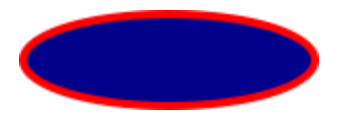

# Xamarin.Forms Shapes


A `Shape` is a type of [`View`](xref:Xamarin.Forms.View) that enables you to draw a shape to the screen. `Shape` objects can be used inside layout classes and most controls, because the `Shape` class derives from the `View` class.

Xamarin.Forms Shapes is available in the `Xamarin.Forms.Shapes` namespace on iOS, Android, macOS, the Universal Windows Platform (UWP), and the Windows Presentation Foundation (WPF).

> [!IMPORTANT]
> Xamarin.Forms Shapes is currently experimental and can only be used by setting the `Shapes_Experimental` flag. For more information, see [Experimental Flags](~/xamarin-forms/internals/experimental-flags.md).

`Shape` defines the following properties:

- `Aspect`, of type `Stretch`, describes how the shape fills its allocated space. The default value of this property is `Stretch.None`.
- `Fill`, of type [`Color`](xref:Xamarin.Forms.Color), indicates the color used to paint the shape's interior.
- `Stroke`, of type [`Color`](xref:Xamarin.Forms.Color), indicates the color used to paint the shape's outline.
- `StrokeDashArray`, of type `DoubleCollection`, which represents a collection of `double` values that indicate the pattern of dashes and gaps that are used to outline a shape.
- `StrokeDashOffset`, of type `double`, specifies the distance within the dash pattern where a dash begins. The default value of this property is 0.0.
- `StrokeLineCap`, of type `PenLineCap`, describes the shape at the beginning and end of a line or segment. The default value of this property is `PenLineCap.Flat`.
- `StrokeLineJoin`, of type `PenLineJoin`, specifies the type of join that is used at the vertices of a shape. The default value of this property is `PenLineJoin.Miter`.
- `StrokeThickness`, of type `double`, indicates the width of the shape outline. The default value of this property is 1.0.

These properties are backed by [`BindableProperty`](xref:Xamarin.Forms.BindableProperty) objects, which means that they can be targets of data bindings, and styled.

Xamarin.Forms defines a number of objects that derive from the `Shape` class. These are `Ellipse`, `Line`, `Path`, `Polygon`, `Polyline`, and `Rectangle`.

## Paint shapes

[`Color`](xref:Xamarin.Forms.Color) objects are used to paint a shapes's `Stroke` and `Fill`:

```xaml
<Ellipse Fill="DarkBlue"
         Stroke="Red"
         StrokeThickness="4"
         WidthRequest="150"
         HeightRequest="50"
         HorizontalOptions="Start" />
```

In this example, the stroke and fill of an `Ellipse` are specified:



> [!IMPORTANT]
> If you don't specify a [`Color`](xref:Xamarin.Forms.Color) value for `Stroke`, or if you set `StrokeThickness` to 0, then the border around the shape is not drawn.

For more information about valid [`Color`](xref:Xamarin.Forms.Color) values, see [Colors in Xamarin.Forms](~/xamarin-forms/user-interface/colors.md).

## Stretch shapes

`Shape` objects have an `Aspect` property, of type `Stretch`. This property determines how a `Shape` object's contents is stretched to fill the `Shape` object's layout space. A `Shape` object's layout space is the amount of space the `Shape` is allocated by the Xamarin.Forms layout system, because of either an explicit `WidthRequest` and `HeightRequest` setting or because of its `HorizontalOptions` and `VerticalOptions` settings.

The `Stretch` enumeration defines the following members:

- `None`, which indicates that the content preserves its original size. This is the default value of the `Shape.Aspect` property.
- `Fill`, which indicates that the content is resized to fill the destination dimensions. The aspect ratio is not preserved.
- `Uniform`, which indicates that the content is resized to fit the destination dimensions, while preserving the aspect ratio.
- `UniformToFill`, indicates that the content is resized to fill the destination dimensions, while preserving the aspect ratio. If the aspect ratio of the destination rectangle differs from the source, the source content is clipped to fit in the destination dimensions.

The following XAML shows how to set the `Aspect` property:

```xaml
<Path Aspect="Uniform"
      Stroke="Yellow"
      StrokeThickness="1"
      Fill="Red"
      BackgroundColor="LightGray"
      HorizontalOptions="Start"
      HeightRequest="100"
      WidthRequest="100">
    <Path.Data>
        <!-- Path data goes here -->
    </Path.Data>  
</Path>      
```

In this example, a `Path` object draws a heart. The `Path` object's `WidthRequest` and `HeightRequest` properties are set to 100 device-independent units, and its `Aspect` property is set to `Uniform`. As a result, the object's contents are resized to fit the destination dimensions, while preserving the aspect ratio:


## Related links

- [ShapeDemos (sample)](https://github.com/xamarin/xamarin-forms-samples/tree/master/UserInterface/ShapesDemos/)
- [Colors in Xamarin.Forms](~/xamarin-forms/user-interface/colors.md)
