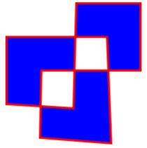
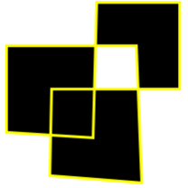

# Xamarin.Forms Shapes: Polygon


[ Download the sample](https://docs.microsoft.com/samples/xamarin/xamarin-forms-samples/userinterface-shapesdemos/)

The `Polygon` class derives from the `Shape` class, and can be used to draw polygons, which are connected series of lines that form closed shapes. For information on the properties that the `Polygon` class inherits from the `Shape` class, see [Xamarin.Forms Shapes](index.md).

`Polygon` defines the following properties:

- `Points`, of type `PointCollection`, which is a collection of [`Point`](xref:Xamarin.Forms.Point) structures that describe the vertex points of the polygon.
- `FillRule`, of type `FillRule`, which specifies how the interior fill of the shape is determined. The default value of this property is `FillRule.EvenOdd`.

These properties are backed by [`BindableProperty`](xref:Xamarin.Forms.BindableProperty) objects, which means that they can be targets of data bindings, and styled.

The `PointsCollection` type is an `ObservableCollection` of [`Point`](xref:Xamarin.Forms.Point) objects. The `Point` structure defines `X` and `Y` properties, of type `double`, that represent an x- and y-coordinate pair in 2D space. Therefore, the `Points` property should be set to a list of x-coordinate and y-coordinate pairs that describe the polygon vertex points, delimited by a single comma and/or one or more spaces. For example, "40,10 70,80" and "40 10, 70 80" are both valid.

For more information about the `FillRule` enumeration, see [Xamarin.Forms Shapes: Fill rules](fillrules.md).

## Create a Polygon

To draw a polygon, create a `Polygon` object and set its `Points` property to the vertices of a shape. A line is automatically drawn that connects the first and last points. To paint the inside of the polygon, set its `Fill` property to a [`Color`](xref:Xamarin.Forms.Color). To give the polygon an outline, set its `Stroke` property to a [`Color`](xref:Xamarin.Forms.Color). The `StrokeThickness` property specifies the thickness of the polygon outline.

The following XAML example shows how to draw a filled polygon:

```xaml
<Polygon Points="40,10 70,80 10,50"
         Fill="AliceBlue"
         Stroke="Green"
         StrokeThickness="5" />
```

In this example, a filled polygon that represents a triangle is drawn:


The following XAML example shows how to draw a dashed polygon:

```xaml
<Polygon Points="40,10 70,80 10,50"
         Fill="AliceBlue"
         Stroke="Green"
         StrokeThickness="5"
         StrokeDashArray="1,1"
         StrokeDashOffset="6" />
```

In this example, the polygon outline is dashed:


For more information about drawing a dashed polygon, see [Draw dashed shapes](index.md#draw-dashed-shapes).

The following XAML example shows a polygon that uses the default fill rule:

```xaml
<Polygon Points="0 48, 0 144, 96 150, 100 0, 192 0, 192 96, 50 96, 48 192, 150 200 144 48"
         Fill="Blue"
         Stroke="Red"
         StrokeThickness="3" />
```

In this example, the fill behavior of each polygon is determined using the `EvenOdd` fill rule.



The following XAML example shows a polygon that uses the `Nonzero` fill rule:

```xaml
<Polygon Points="0 48, 0 144, 96 150, 100 0, 192 0, 192 96, 50 96, 48 192, 150 200 144 48"
         Fill="Black"
         FillRule="Nonzero"
         Stroke="Yellow"
         StrokeThickness="3" />
```



In this example, the fill behavior of each polygon is determined using the `Nonzero` fill rule.

## Related links

- [ShapeDemos (sample)](https://docs.microsoft.com/samples/xamarin/xamarin-forms-samples/userinterface-shapesdemos/)
- [Xamarin.Forms Shapes](index.md)
- [Xamarin.Forms Shapes: Fill rules](fillrules.md)
